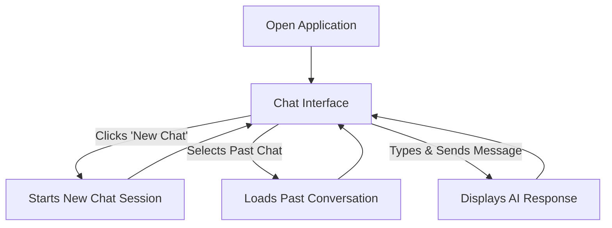

## 1. Product Overview
This project is an Apple-inspired AI chat application featuring a responsive, elegant glassmorphism UI and smooth animations. It aims to provide a premium user experience for interacting with a Retrieval-Augmented Generation (RAG) AI, making conversations intuitive and visually pleasing for all users.

## 2. Core Features

### 2.1 Feature Module
The application is a single-page interface composed of the following core modules:
1.  **Sidebar**: Manages chat history and user information.
2.  **Chat Area**: Displays the conversation between the user and the AI.
3.  **Input Area**: Allows the user to compose and send messages.

### 2.2 Page Details
| Page Name | Module Name | Feature description |
|-----------|-------------|---------------------|
| Chat Interface | Sidebar | - Display app branding and a "New Chat" button. - List previous chat sessions in a scrollable view. - Allow users to switch between or start new chats. - Show user avatar and name at the bottom. |
| Chat Interface | Chat Area | - Render conversation history with distinct styles for user and AI messages. - Align user messages to the right and AI messages to the left. - Support Markdown for rich text formatting in AI responses. - Animate new messages as they appear. - Show a typing indicator while the AI is generating a response. |
| Chat Interface | Input Area | - Provide a multi-line text area that automatically resizes with content. - Include a "Send" button that provides visual feedback when clicked. - Disable the input and send button while waiting for an AI response. - Support `Enter` to send and `Shift+Enter` for new lines. - Display a character counter to indicate input length. |

## 3. Core Process
The user interacts with the AI within a single, unified chat interface. The primary flow involves the user sending a message and receiving a response from the AI. Users can manage their conversations by creating new chats or revisiting previous ones from the sidebar.

## 4. User Interface Design
### 4.1 Design Style
- **Primary Color**: `#0071E3` (Apple Blue)
- **Secondary Color**: `#86868B` (Secondary Text)
- **Button Style**: Rounded, pill-shaped buttons with subtle hover and press effects.
- **Font**: System UI fonts (SF Pro, Segoe UI, Roboto) for a native feel.
- **Layout Style**: Desktop-first layout with a fixed sidebar and a central content area.
- **Icon Style**: Minimalist and clean, similar to SF Symbols.

### 4.2 Page Design Overview
| Page Name | Module Name | UI Elements |
|-----------|-------------|-------------|
| Chat Interface | Sidebar | - Uses a glassmorphism effect (`background: rgba(255, 255, 255, 0.65)`, `backdrop-filter: blur(20px)`). - Fixed 280px width on desktop. - Chat history items have a gentle lift and shadow effect on hover. |
| Chat Interface | Chat Area | - Message bubbles have a glassmorphism style. - User messages feature a blue tint; AI messages have a neutral tint. - Messages enter with a fade and slide animation powered by GSAP. |
| Chat Interface | Input Area | - Textarea and bottom bar use the core glassmorphism effect. - Input field glows on focus. - Send button scales down on press for micro-interaction feedback. |

### 4.3 Responsiveness
The application follows a desktop-first responsive design strategy, adapting gracefully to tablet and mobile screen sizes.
- **Desktop**: Fixed sidebar (280px) and a centered chat area (max-width 720px).
- **Tablet**: Collapsible, icon-only sidebar and a wider chat area.
- **Mobile**: Sidebar becomes an off-canvas drawer, and the chat area takes up the full width for a focused experience.
