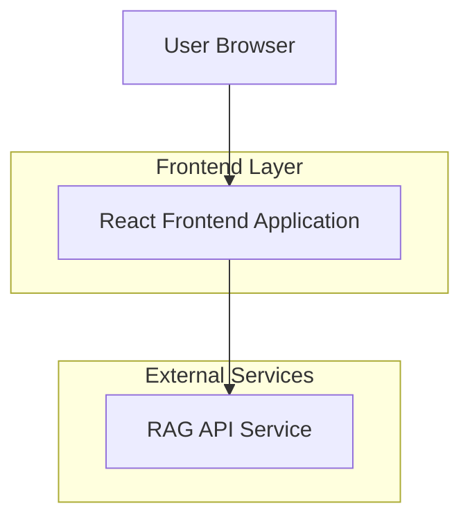
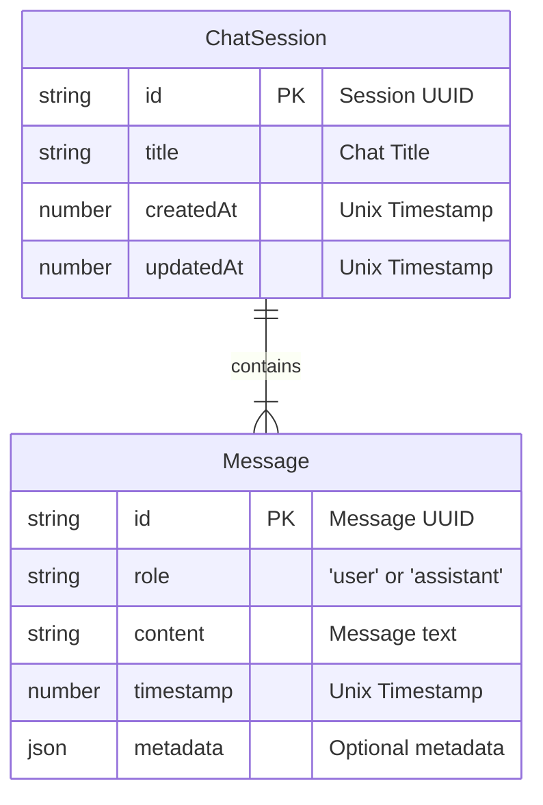

## 1.Architecture design
The application is a client-side React application that communicates directly with an external RAG API for chat functionalities. There is no custom backend, simplifying deployment and maintenance.



## 2.Technology Description
- **Frontend**: React@18, Vite, Tailwind CSS, shadcn/ui, GSAP
- **Initialization Tool**: vite-init
- **Backend**: None (consumes an external API)

## 3.Route definitions
The application is a Single-Page App (SPA). Routing can be used to handle specific chat sessions.

| Route | Purpose |
|-------|---------|
| / | Main chat interface, loading the most recent or a new session. |
| /c/:sessionId | Displays a specific chat session, allowing for shareable links. |


## 4.API definitions
The frontend interacts with a RAG API to send and receive messages.

### 4.1 Core API

**Send Chat Message**
```
POST /chat
```

**Request Body**:
| Param Name| Param Type  | isRequired  | Description |
|-----------|-------------|-------------|-------------|
| message  | string      | true        | The user's message content. |
| session_id  | string      | true      | A UUIDv4 identifying the current chat session. |

**Example Request Body**:
```json
{
  "message": "Hello, what is Retrieval-Augmented Generation?",
  "session_id": "a1b2c3d4-e5f6-7890-1234-567890abcdef"
}
```

**Example Response Body (Assumed)**:
```json
{
  "id": "msg_xyz",
  "role": "assistant",
  "content": "Retrieval-Augmented Generation (RAG) is a technique...",
  "timestamp": 1678886400000
}
```

## 5.Server architecture diagram
Not applicable, as there is no server-side component in this project's architecture.

## 6.Data model

### 6.1 Data model definition
The client-side data structure for managing chat sessions and messages is defined by the following entities.


